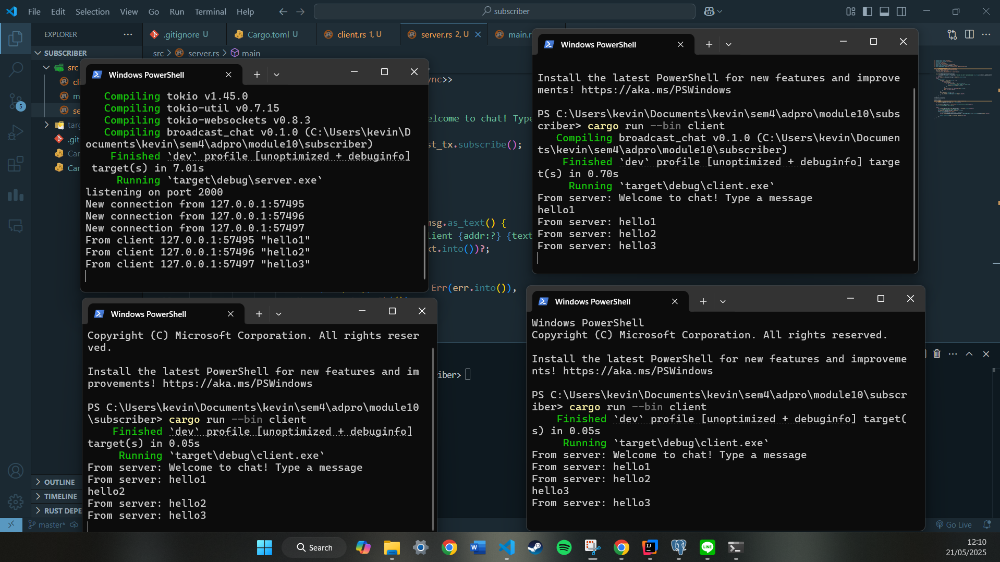
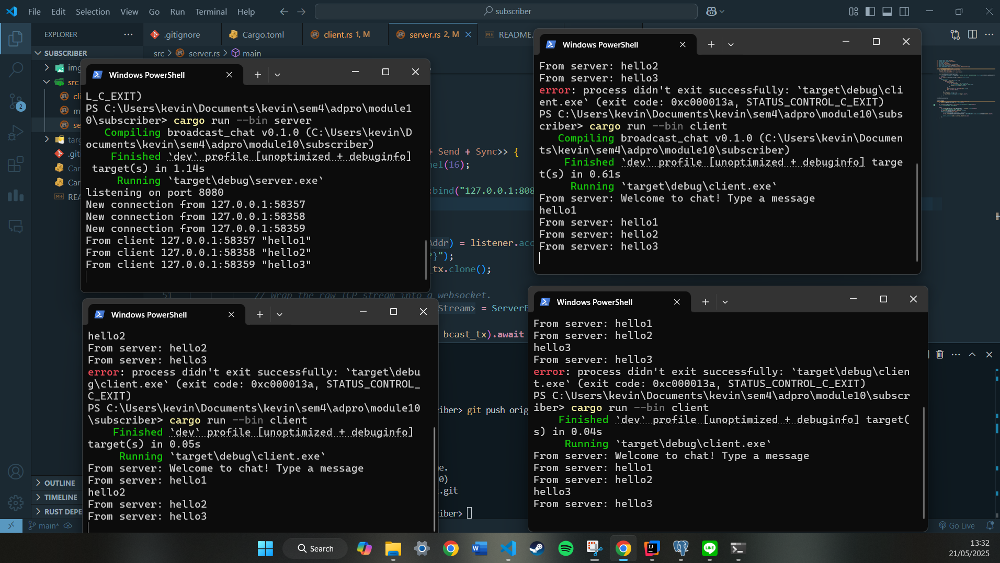
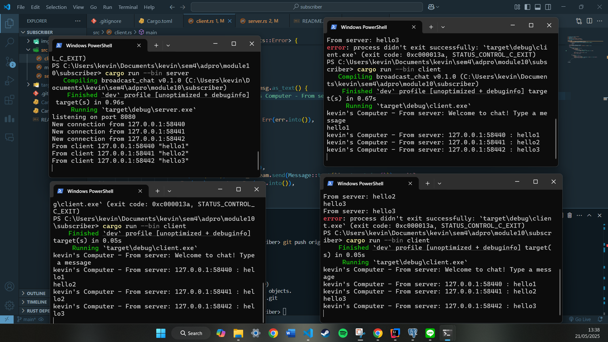

## understanding How It Works

In this experiment, we explored a broadcast chat application using asynchronous programming and WebSockets in Rust. One server process was started to listen for incoming connections, and three clients were launched from different terminals. When a client sends a message "hello1", "hello2", "hello3", the server receives and broadcasts it to all connected clients. every client prints out all the messages sent by any other client, demonstrating real-time message delivery. This behavior is enabled by asynchronous tasks that allow the server to handle multiple connections concurrently without blocking. It shows how async programming is well-suited for real-time applications like chat, where responsiveness and concurrency are essential.

## 2.2 Modifying the port

In this experiment, the WebSocket port was changed from 2000 to 8080 on both the server and client sides. The server was modified to bind to 127.0.0.1:8080, and the client was updated to connect using the URI ws://127.0.0.1:8080. After running the server and then multiple clients, the connection worked successfully, as shown in the screenshot. Each client was able to send and receive broadcast messages from the server without issues. This confirms that the WebSocket protocol (ws://) remains consistent and only the port number needs to be updated on both ends for communication to succeed. It demonstrates that as long as the server is listening on the correct port and the clients are targeting the same one, the application can communicate over WebSockets without needing changes to the protocol itself.

## 2.3 Modifying Small Changes

In this experiment, we modified the server to include the sender’s IP address and port in the broadcasted message. This change helps identify the origin of each message without needing usernames. On the server side, the message sent to clients was updated to include the addr (client's socket address), so it formats like 127.0.0.1:PORT : message. After making this change, all clients now receive and display messages that clearly show the source address of each sender. As seen in the screenshot, each message is tagged with the sender’s IP and port, making it easier to trace communication in a multi-client environment. This demonstrates a simple yet useful enhancement that improves transparency in client-server messaging.
